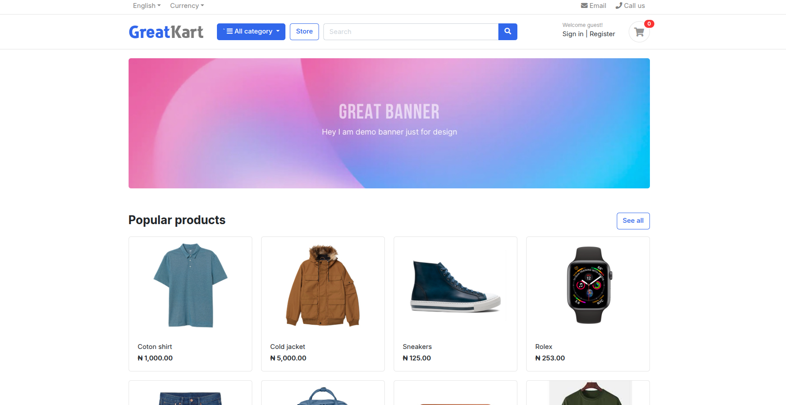
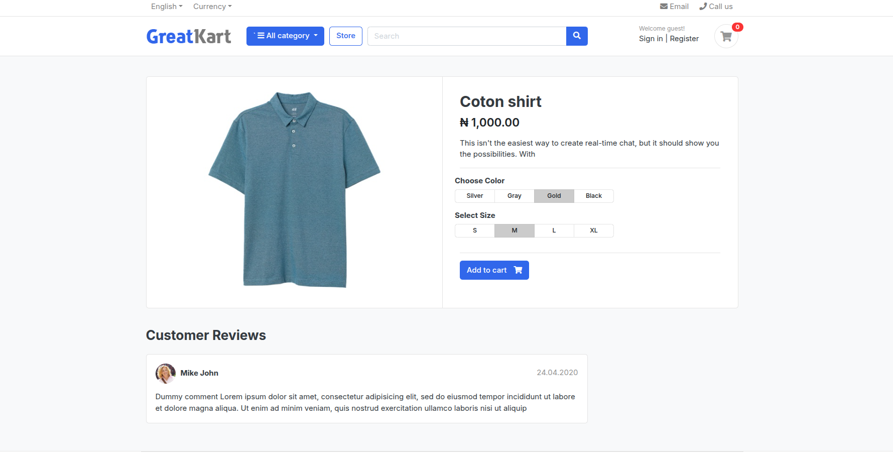
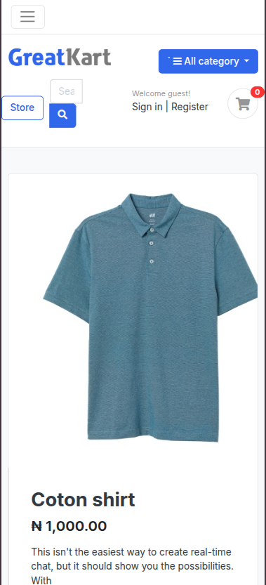

# Django E-Commerce Web App

This is a Django-based e-commerce web application built with HTML, CSS, Bootstrap for responsive design, and Stripe integration for secure payment processing. The app provides users with a seamless shopping experience, from browsing products to completing purchases online.

---

## Features

- User-friendly product catalog with searchable and categorized product listings
- Detailed product pages with production-images/prod1and descriptions
- Shopping cart functionality to add, update, or remove items
- Secure checkout process powered by Stripe payment gateway
- User account registration, login, and profile management
- Order history and tracking for registered users
- Responsive and mobile-friendly design using Bootstrap
- Admin dashboard to manage products, orders, and users
- Image upload support for product production-images/prod1- Real-time validation and feedback on forms

---

## Getting Started

### Prerequisites

| Name      | Version                        |
|-----------|-------------------------------|
| Python    | 3.8+                          |
| pip       | Latest (Python package installer) |
| PostgreSQL| Preferred SQL database (update settings accordingly) |
| Stripe    | Stripe account for API keys    |

### Installation

1. Clone the repository:

git clone <repository-url>
cd <project-folder>

2. Create and activate a Python virtual environment:
python3 -m venv .venv
source .venv/bin/activate # On Windows: .venv\Scripts\activate

3. Install dependencies:

pip install -r requirements.txt

4. Configure environment variables:

Create a `.env` file in the project root with your environment-specific settings, for example:
DJANGO_SECRET_KEY=your_secret_key
DB_NAME=your_db_name
DB_USER=your_db_user
DB_PASSWORD=your_db_password
STRIPE_PUBLIC_KEY=your_stripe_public_key
STRIPE_SECRET_KEY=your_stripe_secret_key

5. Apply database migrations:

python manage.py migrate

6. Create a superuser (admin):
python manage.py createsuperuser

7. Collect on manage.py collectstatic

### Running the Development Server

Start the server locally:
python manage.py runserver

Access the app at `http://127.0.0.1:8000/`

---

## Production Photos

| ID   | Image                                      |
|-----------|--------------------------------------------|
|  1 |  |
|  2 |  |
|  3 |  |

This will render the images directly in your README if viewed on a platform that supports local image paths.

## License

This project is licensed under the MIT License. See the [MIT License](LICENSE) file for details.

---

If you have any questions or want to contribute, feel free to open an issue or submit a pull request.

